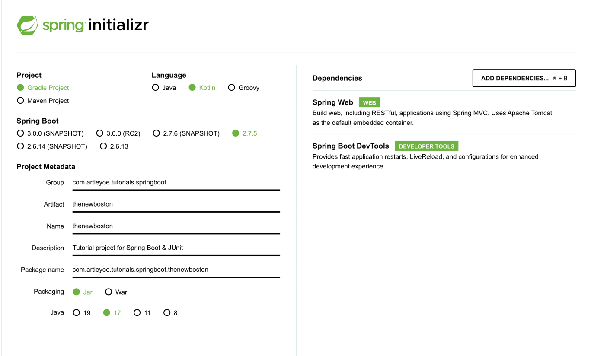
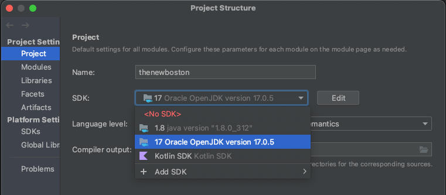

# Spring Boot with Kotlin & JUnit 5 tutorial

Author : Sunho Hong (https://github.com/sunhohong)
> note : This is a recap of the tutorial

### Reference
This tutorial project is based on following series of Youtube videos:
* [Spring Boot with Kotlin & JUnit 5 - Tutorials](https://www.youtube.com/playlist?list=PL6gx4Cwl9DGDPsneZWaOFg0H2wsundyGr)

### Prerequisites
* JDK 17
* IntelliJ IDEA
* Gradle 7.3
* Spring Boot 2.5.6
* Kotlin 1.6.0
* JUnit 5.8.1
* Spring Web 2.5.6
* Spring Boot DevTools 2.5.6

### Getting Started
* Create a new project with Spring Initializr (https://start.spring.io/)
  

### Test
#### without IDE
* Run `./gradlew test` to run all tests
#### with IDE
* Run test on IDE menu `Run > Run 'All Tests'`

### Tips
* If the project doesn't build with Java version problem, try to change the version from project structure settings. (find under file menu or CMD + ;)
  
* If the project doesn't build with Gradle version problem, try to change the JDK path in .zshrc (or .bashrc) file.